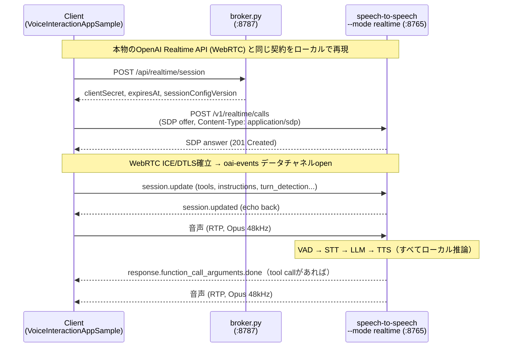
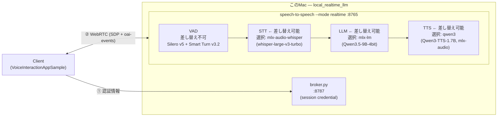

# local_realtime_llm

**OpenAI Realtime API（WebRTC）互換のローカルサーバー。** STT/LLM/TTSはすべて
Apple Silicon上でローカル推論し、外部APIには一切依存しない。

[VoiceInteractionAppSample](https://github.com/aRaikoFunakami/VoiceInteractionAppSample)
（Android Automotive, `VoiceInteractionService`実装）から実機/エミュレータで接続し、
発話→STT→LLM→TTS→再生の一連の流れをエンドツーエンドで確認済み
（詳細は[docs/phase1-macbook.md](docs/phase1-macbook.md)）。

## できること

- STT / LLM / TTSはCLIフラグで差し替え可能。今回はMLX（Apple Silicon）
  バックエンドを使い、モデル・GPUとも全部このMac上で動く。
- function calling（tool call）も動く。クライアントがセッションに登録した
  ツール（例: YouTube検索）をLLMが実際に呼び出し、`response.function_call_arguments.done`
  相当のイベントで結果を返す一連の往復を確認済み。

## アーキテクチャ

自作のWebRTCサーバーではなく、[huggingface/speech-to-speech](https://github.com/huggingface/speech-to-speech)
の`--mode realtime`をそのまま使う。理由:

- WebRTC実装がOpenAI Realtime APIを模倣する設計（データチャネル名`oai-events`、
  エンドポイント`POST /v1/realtime/calls`が完全一致）
- `session.update`のパースにOpenAI公式Python SDKの型定義をそのまま使っている
- STT/LLM/TTSがバックエンド登録制でプラグイン化されている → 差し替えは
  CLIフラグの変更だけで済む

クライアントから見ると、接続先のホスト名を`api.openai.com`からこのMacに
変えるだけで、あとは本物のOpenAI Realtime API（WebRTC）を叩いているのと
同じシーケンスになる:



サーバー内部はVAD→STT→LLM→TTSの直列パイプラインで、各段はCLIフラグで
差し替え可能なバックエンド登録制になっている。図中の各ボックスが今回選んだ実体:



## Mac (Apple Silicon) 向けにやっていること

`speech-to-speech`自体はCUDA/Linuxが第一級だが、Darwin（macOS）向けの分岐が
組み込まれている。ここで実際にやっているのはその分岐に乗ることで、新規に
何かをMac用に書いたわけではない:

- 推論バックエンドはMLX（Appleの配列/自動微分フレームワーク、Metal経由でGPUを使う）。
  `pyproject.toml`を見ると`mlx` / `mlx-lm` / `mlx-audio`は`platform_system == 'Darwin'`
  条件でコア依存に入っており、CUDA版のような追加extraは不要。
- STT/TTSの各ハンドラはmacOS上では自動的にmlx-audio実装に切り替わる
  （例: `qwen3_tts_handler.py`は`platform == "darwin"`ならmlx-audioバックエンドを
  選ぶ）。今回のTTSはこのmacOSデフォルト動作をそのまま使っている。
- `--device mps`でMetal Performance Shadersを使う指定をしているが、
  mlx-lm/mlx-audio自体はMLXが常にMetal上で動くため実質的な効果はSTT/TTS側の
  一部フラグ向け。
- MLXはプロセス内で単一のMetal command queueを共有するため、STT/LLM/TTSを
  同時に走らせるとクラッシュする（`Completed handler provided after commit call`）。
  そのため`speech_to_speech.utils.mlx_lock.MLXLockContext`という排他ロックで
  3段を直列化している。Unified Memoryが大きくても3モデルが完全並列でGPUを
  使うことはない — レイテンシがSTT+LLM+TTSの単純合算に近くなる理由。
- Python 3.14（Homebrewの既定）ではなく3.12のvenvを使っている。mlx系の
  wheel公開が最新Pythonに追随しきっていないため。

## セットアップ

[uv](https://docs.astral.sh/uv/)でPythonバージョンと依存関係をロックしている
（`.python-version`=3.12、`pyproject.toml`/`uv.lock`）。uvが無ければ
`curl -LsSf https://astral.sh/uv/install.sh | sh`。

```bash
uv sync
```

これだけで、Python 3.12（無ければuvが自動取得）+ `speech-to-speech[webrtc]==0.2.12`
（および固定された全依存）が`.venv`に入る。`python3.12`をシステムに手動で
用意する必要はない（Mac Studioなど別マシンでも`uv sync`だけで同じ環境を再現できる）。

## 起動

```bash
uv run speech-to-speech \
  --mode realtime \
  --device mps \
  --stt mlx-audio-whisper \
  --language ja \
  --no_enable_live_transcription \
  --llm_backend mlx-lm \
  --model_name mlx-community/Qwen3.5-9B-4bit \
  --tts qwen3 \
  --qwen3_tts_speaker ono_anna \
  --qwen3_tts_mlx_quantization bf16 \
  --ws_host 127.0.0.1 --ws_port 8765
```

別ターミナルでセッションブローカー（クライアントの認証情報取得先スタブ）を起動:

```bash
uv run python broker.py   # 0.0.0.0:8787
```

### モデルの扱い（自動ダウンロード / 事前ダウンロード）

`--model_name` / `--mlx_audio_whisper_model_name` / `--qwen3_tts_model_name`に
Hugging Face Hub上のリポジトリIDを渡すと、起動時に`huggingface_hub`が自動で
ダウンロードして`~/.cache/huggingface/hub/`にキャッシュする（2回目以降の起動は
キャッシュを使うので速い）。何もしなくてよい。

個別に事前ダウンロードしてから使いたい場合は2通りある:

**方法1: デフォルトキャッシュに落としておく**（コード変更不要、同じモデル名を
指定すれば自動でキャッシュを使う）

```bash
uv run hf download mlx-community/Qwen3.5-9B-4bit
uv run hf download mlx-community/whisper-large-v3-turbo
uv run hf download mlx-community/Qwen3-TTS-12Hz-1.7B-CustomVoice-bf16
```

**方法2: 任意のローカルディレクトリに落として、そのパスを直接指定**
（HFへのアクセスなしでオフライン運用したい・他のMacにモデルフォルダごと
コピーしたい場合向け）

```bash
uv run hf download mlx-community/Qwen3.5-9B-4bit --local-dir ./models/Qwen3.5-9B-4bit
# 起動時: --model_name ./models/Qwen3.5-9B-4bit
```

完全オフラインで起動できるか（＝必要なモデルが揃っているか）は
`HF_HUB_OFFLINE=1 uv run speech-to-speech ...`で確認できる。

ヘルスチェック:

```bash
curl -s http://127.0.0.1:8765/v1/pool
curl -s http://127.0.0.1:8765/v1/usage
```

クライアント（VoiceInteractionAppSample）側は設定画面でLOCALモードを選び、
ホストにこのMacのアドレス（AVDなら`10.0.2.2`、実機なら同一LAN上のIP）を入れる。

## 動作確認済みスタック

| 項目 | 選定 |
|---|---|
| VAD | Silero VAD v5 + Smart Turn v3.2 |
| STT | `mlx-audio-whisper`（whisper-large-v3-turbo, MLX、日本語対応） |
| LLM | `mlx-lm`（`mlx-community/Qwen3.5-9B-4bit`） |
| TTS | `qwen3`（Qwen3-TTS-1.7B-CustomVoice, bf16, mlx-audio, speaker=`ono_anna`） |
| Transport | WebRTC (`/v1/realtime/calls`) / WebSocket (`/v1/realtime`) |

発話終了→初回音声再生: 約4.5〜5.3秒（内訳・トレードオフの詳細は
[docs/phase1-macbook.md](docs/phase1-macbook.md)）。

## 既知の問題と対処（詳細はdocs/参照）

- デフォルトSTT（Parakeet-TDT）は日本語非対応 → `mlx-audio-whisper`を使う
- `--enable_live_transcription`（デフォルトON）は発話の途中でSTTを確定してしまい
  認識が壊れる → `--no_enable_live_transcription`必須
- 小さいLLM（Qwen3-4B）はtool callingを確実に発行できない → 9B以上を使う
- ローカルTTS（Qwen3-TTS）はOpenAI TTSと同水準の音質にはならない
  （コーデック設計上の限界。量子化を上げる程度の改善は可能）

一つずつの根本原因・調査過程は[docs/phase1-macbook.md](docs/phase1-macbook.md)に
すべて記録している。

## 今後

Mac Studio (256GB) を推論サーバーにして、より大きいLLM（Qwen3.5-27B等）での
品質・レイテンシのトレードオフを比較する（Phase 2、未着手）。
